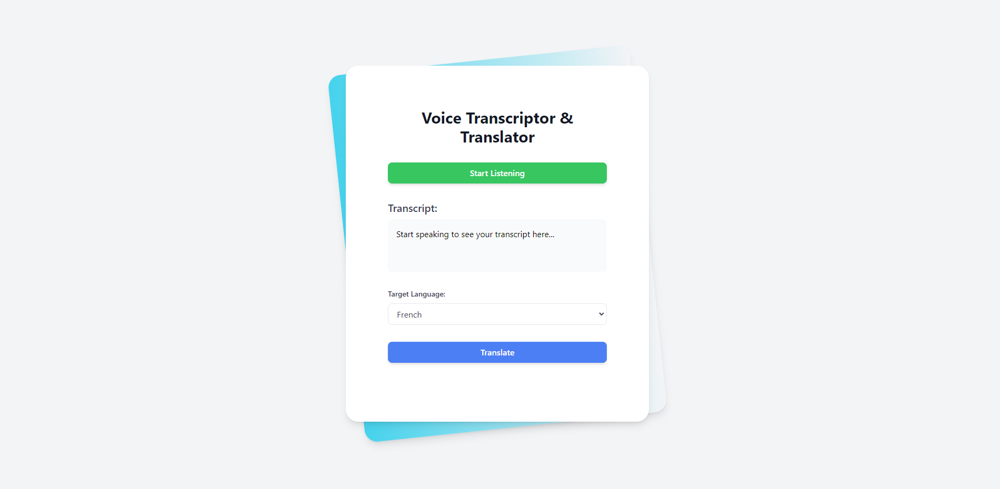

# Voice Transcriptor & Translator
### A Vue.js application that allows users to transcribe speech and translate it into different languages.
    

## Features

- Speech recognition for real-time transcription
- Translation of transcribed text into multiple languages
- Supports Spanish, French, German, Italian, and Portuguese
- User-friendly interface with responsive design

## Technologies Used

- Vue.js 3
- TypeScript
- Tailwind CSS
- open-google-translator

## Installation

1. Clone the repository:
   ```
   git clone https://github.com/rickmff/voice-transcriptor-translator.git
   ```

2. Navigate to the project directory:
   ```
   cd voice-transcriptor-translator
   ```

3. Install dependencies:
   ```
   npm install
   ```

4. Run the development server:
   ```
   npm run dev
   ```

## Usage

1. Open the application in a supported web browser.
2. Click "Start Listening" to begin speech recognition.
3. Speak clearly into your microphone.
4. The transcribed text will appear in the "Transcript" section.
5. Select a target language from the dropdown.
6. Click "Translate" to translate the transcribed text.
7. The translated text will appear in the "Translated Text" section.

## Contributing

Contributions are welcome! Please feel free to submit a Pull Request.

## License

This project is licensed under the [MIT License](LICENSE).
